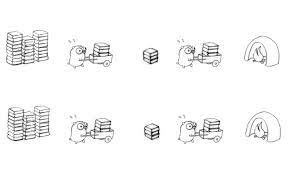

- [introduce](#introduce)
- [What is Concurrency?](#WhatIsConcurrency?)
- [Why use concurrency?](#WhyUseConcurrency?)
- [Distinctive concurrency and parallelism?](#DistinctiveConcurrencyAndParallelism?)
- [What is problem concurrency then it's not strong](#WhatsIsProblemConcurrencyThenIt'sNotStrong?)
- [Pattern](#Pattern)

## Introduce 
In golang, everything is concurrency, almost : worker of a webserver, worker of a certain process, worker of a certain tool. Concurrency is a built-in mechanism at the language layer of golang. Working with concurrency has never been easy. One thing is a must, you must have a pattern when working with concurrency, experience in using and debugging concurrently. If you don't follow a certain concurrency pattern, everything will mess up, there will be bugs that are unpredictable and difficult to control  
I and you dissect the level increment simultaneously, along with the best practices when using it.  
Concurrency:  easy to start, but not easy to stop. Here we go!!!  

## What is Concurrency? 
   
 Concurrency is the composition of independently executing computations. Concurrency is a way to structure software, particularly as a way to write clean code that interacts well with the real world. In Wikipedia: "concurrency is the ability of different parts or units of a program, algorithm, or problem to be executed out-of-order or in partial order, without affecting the final outcome.  
 ==> Summary: There are some problem, we can it executed on many part, maybe is many core or not, ==> summary target : problem run faster but still correct.

Ex: Http WebServer: in one server, we handle many request incoming. To achieve highest for performance, every webserver have solution for concurrency difference. In Golang, summary solution is use routine run worker handle request, there are 3 main way implement:  
   1) every routine for every request.  
   2) pool routine for all request ( in at time, one routine handle one request)  
   3) pool routine with event(Epool, ...)  

## Why use concurrency? 
 Concurrency promoting strength in problems: high load, repeating, not much logic interwoven between tasks in one problem. This problems are many times in present: handle request, handle socket, handle message queue, call api, handle big data ... This is reason concurrency is increasingly popular.  
 In Golang, concurrency implement in routine, one routine cost is 2 to 8 kb ==> mini cost for concurrency.  

## Distinctive concurrency and parallelism?  
   
 For wiki: "Task parallelism (also known as function parallelism and control parallelism) is a form of parallelization of computer code across multiple processors in parallel computing environments. This explanation is not simple for understand it and understand difference with concurrency. There are simple way, follow this case:  
    Assume problem run on computer has only one core CPU. You are never way implement parallelism in this context. But you have way implement concurrency in this context.  
 ===>    Think about this context, you will understand Distinctive concurrency and parallelism.  

## What is problem concurrency then it's not strong ?  
  If bottleneck of problems is not dependency concurrency, is dependency for other condition (io, disk,...), have constraint condition in this task concurrency. Ex: you update inventory, you implement one lock for every update. When high load, you can up number concurrency but over range limit of mutex. Have many routine race on mutex, but performance is not greater. routine 1, routine 2, ... routine n wait and race to have mutex. Time and cost for switch context and routine 1, routine 2... is large. In this context, concurrency is slower simple thread run sync( and not use mutex)  
==> In this problems, children task run on routine is not run independence, problems is not really for concurrency, it is need other solution.  

## Pattern  

todo keep 18 not die 
concurency pattern advance
worker poll best practice