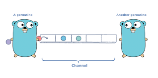
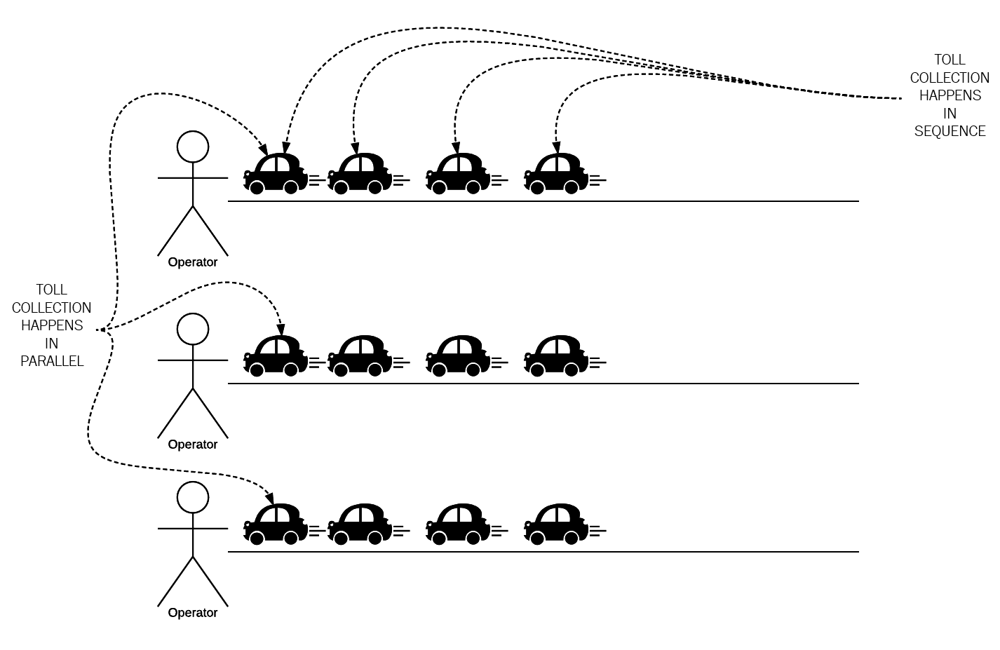

- [introduce](#introduce)
- [What is Concurrency?](#WhatIsConcurrency?)
- [Why use concurrency?](#WhyUseConcurrency?)
- [Distinctive concurrency and parallelism?](#DistinctiveConcurrencyAndParallelism?)
- [What is problem concurrency then it's not strong](#WhatsIsProblemConcurrencyThenIt'sNotStrong?)
- [Pattern](#Pattern)
  - [1) Pass chan to function](#1PassChanToFunction)
  - [2) Generator](#2Generator)
  - [3) Fan in](#3FanIn)
  - [4) Restore sequence](#4RestoreSequence)
  - [5) Select timeout](#5SelectTimeout)
  - [6) Quit signal](#6QuitSignal)
  - [7) Daisy chan](#7DaisyChan)
  - [6) Quit signal](#6QuitSignal)
  - [6) Quit signal](#6QuitSignal)


## Introduce <a name="introduce"></a>
In golang, everything is concurrency, almost : worker of a webserver, worker of a certain process, worker of a certain tool. Concurrency is a built-in mechanism at the language layer of golang. Working with concurrency has never been easy. One thing is a must, you must have a pattern when working with concurrency, experience in using and debugging concurrently. If you don't follow a certain concurrency pattern, everything will mess up, there will be bugs that are unpredictable and difficult to control </br>
I and you dissect the level increment simultaneously, along with the best practices when using it. </br>
Concurrency:  easy to start, but not easy to stop. Here we go!!! </br>

## What is Concurrency? <a name="WhatIsConcurrency"></a>
  </br>
 Concurrency is the composition of independently executing computations. Concurrency is a way to structure software, particularly as a way to write clean code that interacts well with the real world. In Wikipedia: "concurrency is the ability of different parts or units of a program, algorithm, or problem to be executed out-of-order or in partial order, without affecting the final outcome. </br>
 ==> Summary: There are some problem, we can it executed on many part, maybe is many core or not, ==> summary target : problem run faster but still correct.

Ex: Http WebServer: in one server, we handle many request incoming. To achieve highest for performance, every webserver have solution for concurrency difference. In Golang, summary solution is use routine run worker handle request, there are 3 main way implement: </br>
   1) every routine for every request. </br>
   2) pool routine for all request ( in at time, one routine handle one request) </br>
   3) pool routine with event(Epool, ...) </br>

## Why use concurrency? <a name="WhyUseConcurrency?"></a>
 Concurrency promoting strength in problems: high load, repeating, not much logic interwoven between tasks in one problem. This problems are many times in present: handle request, handle socket, handle message queue, call api, handle big data ... This is reason concurrency is increasingly popular. </br>
 In Golang, concurrency implement in routine, one routine cost is 2 to 8 kb ==> mini cost for concurrency. </br>


## Distinctive concurrency and parallelism?  <a name="DistinctiveConcurrencyAndParallelism?"></a>
  </br>
 For wiki: "Task parallelism (also known as function parallelism and control parallelism) is a form of parallelization of computer code across multiple processors in parallel computing environments. This explanation is not simple for understand it and understand difference with concurrency. There are simple way, follow this case: </br>
    Assume problem run on computer has only one core CPU. You are never way implement parallelism in this context. But you have way implement concurrency in this context. </br>
 ===>    Think about this context, you will understand Distinctive concurrency and parallelism. </br>


## What is problem concurrency then it's not strong ?  <a name="WhatsIsProblemConcurrencyThenIt'sNotStrong?"></a>
  If bottleneck of problems is not dependency concurrency, is dependency for other condition (io, disk,...), have constraint condition in this task concurrency. Ex: you update inventory, you implement one lock for every update. When high load, you can up number concurrency but over range limit of mutex. Have many routine race on mutex, but performance is not greater. routine 1, routine 2, ... routine n wait and race to have mutex. Time and cost for switch context and routine 1, routine 2... is large. In this context, concurrency is slower simple thread run sync( and not use mutex) </br>
==> In this problems, children task run on routine is not run independence, problems is not really for concurrency, it is need other solution. </br>

## Pattern  <a name="Pattern"></a>

todo keep 18 not die 
concurency pattern advance
worker poll best practice
worker poll remote memory

18,19,20 dung cho nhung concurrency phoi hop data chat che và nhieu custom ve luong xu l
workker pool thich hop cho job don gian, khong có qua nhieu custom va quan hẹ data, nó tien cho nguoi dung việc khởi tạo và clear tài nguyên đã được thư viện làm hết rồi


## 1) Pass chan to function  <a name="1PassChanToFunction"></a>
 </br>
Example in: https://github.com/Nghiait123456/GolangAdvance/blob/master/ConcurrencyPattern/1_pass_chan_to_function/main.go </br>

Channel is tool sync data from many concurrency. It is strong, popular and flexible. In this example, I simply write to it in the routine and read it in main (maybe in another routine). It's so simple that, you don't need to understand how it syncs data, golang has built and fully integrated a tool syncs feature in the channel. </br>

## 2) Generator  <a name="2Generator"></a>
Example in: https://github.com/Nghiait123456/GolangAdvance/blob/master/ConcurrencyPattern/2_generator/main.go </br>

I have 2 function run on 2 routine, every functions pass data in to one channel. In main, i sequentially get all the data of all those channels. A very simple pattern and has quite a few weaknesses. This weakness will be analyzed in the samples below. </br>


## 3) Fan in  <a name="3FanIn"></a>
 </br>
Example in: https://github.com/Nghiait123456/GolangAdvance/blob/master/ConcurrencyPattern/3_fan_in/main.go </br>

In terms of features, it's the same as Example 2, but I've improved it a bit. A common channel is created to capture data streams from all individual channels. That common channel will be the channel that any place to read will take. </br>
A smart move, you have hundreds of routines and hundreds of channels containing data, you will also only need to care about a single endpoint channel to get the data. The performance bottleneck is almost absent in most backend problems, it usually only appears in some very deep performance problems in the OS kernel. </br>
A simple, powerful and commonly used pattern. </br>


## 4) Restore sequence  <a name="4RestoreSequence"></a>
 </br>

Example in: https://github.com/Nghiait123456/GolangAdvance/blob/master/ConcurrencyPattern/4_restore_sequence/main.go </br>

In patter 3) Fan in, consummer and producer continuously run and retrieve data, ignoring order of data retrieval and interaction. Now, I want when a consummer pushes 1 data, the producer has to process it, then let allow the consummer do the work and push the data continue. The idea: each stream will have an endpoint to coordinate, block, and allow to work. Fortunately, the channel already has that feature. </br>

Each routine will create a waitForIt channel, after writing data, worker loops at "<- waitForIt" until it is allowed to work in "msg.wait <- true //". </br>

In golang, synchronous and asynchronous handling becomes simple with channels. In languages ​​where there is no direct concurrency build in that language, using an external packet, this is often more complicated and not very performant. </br>


## 5) Select timeout  <a name="5SelectTimeout"></a>
Example in: https://github.com/Nghiait123456/GolangAdvance/blob/master/ConcurrencyPattern/5_select_timeout/main.go </br>

I have many routine and many channel data for one job, and we want to set timeout for it. Idea: there must be a loop that checks that and a timeout signal </br>

In golang, there are two concurrency structures: </br>
1) event loop for multiple events: </br>
```
for {
    select {
    case s := <-c:
        fmt.Println(s)
    case <-timeout:
        fmt.Println("You talk too much.")
        return
    }
}
```
 </br>

2) channel for detail event: ```case <-timeout:``` </br>

I use structure 1 for looping, and structure 2 for signal processing (with data, timeout). Everything works fine until the event timeout is caught. I insert my timeout handler and it's over. </br>


## 6) Quit signal <a name="6QuitSignal"></a>
Example in: https://github.com/Nghiait123456/GolangAdvance/blob/master/ConcurrencyPattern/6_quit_signal/main.go </br>

Quite similar to the idea of pattern 5, I want to quit my job when I want. I implement a quit channel, catch the signal and process on it. </br>


## 7) Daisy chan <a name="7DaisyChan"></a>
 </br>
Example in: https://github.com/Nghiait123456/GolangAdvance/blob/master/ConcurrencyPattern/7_daisy_chan/main.go

This pattern demonstrates that it is possible to create a large number of go routines, and it makes clear the block of channel property. </br>
This is Rob Pike's pattern and I tried to rewrite it in a way that is easier to understand for newbies.I made 10000 chanel loops that block each other: </br>
left <- (new) right (now left) <- (new) right (now left) <- ... </br>
channel 1 <- channel 2 <-.... <- chanel 10000 </br>
This block only ends when channel 100000 is written, and all channels and routines containing it are released. Run the code and you'll see I've printed this in detail. </br>

In Rob Pike's original example, there is another pretty easy explanation, you can refer to: https://stackoverflow.com/questions/26135616/understand-the-code-go-concurrency-pattern-daisy-chain </br>