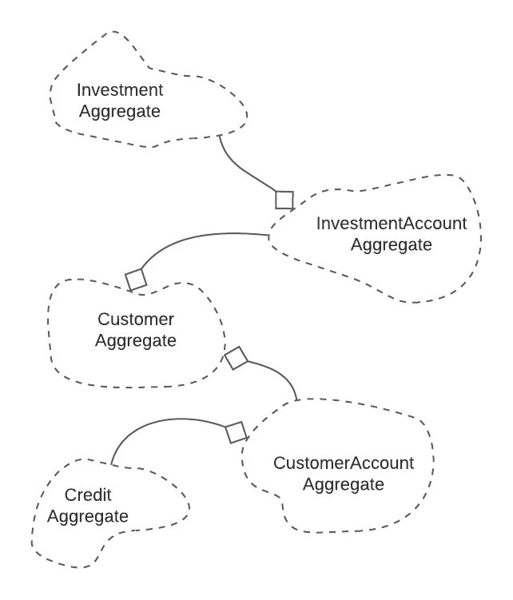
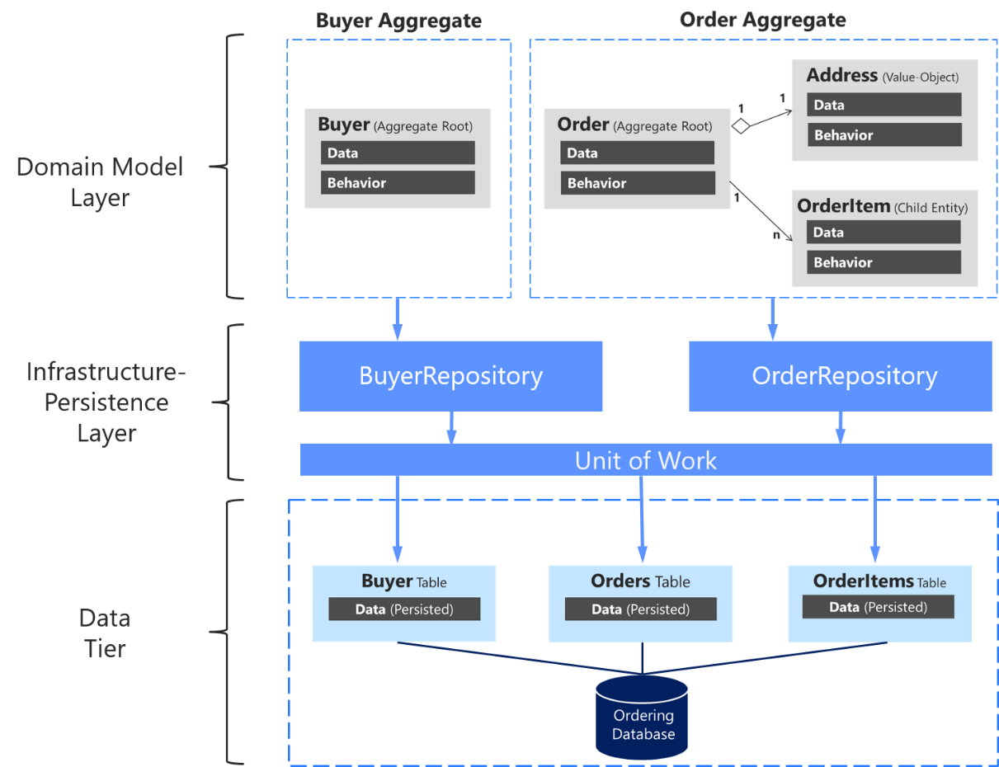
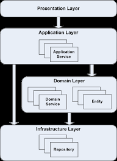

- [Introduce](#introduce)
- [Source](#source)
- [Directories](#directories)
    - [Layout](#layout)
    - [Domain](#domain)
    - [Entity](#entity)
    - [Aggregate](#aggregate)
    - [Infrastructure](#infrastructure)
    - [Repositories](#repositories)
    - [User Interface](#user_interface)
    - [DTO](#dto)
    - [API Interface](#api_interface)
    - [WEB Interface](#web_interface)
    - [Packet layer](#packet_layer)
    - [Application](#application)
    - [Services](#services)
    - [Value Object](#value_object)
    - [Modules](#modules)

## Introduce 

In 2003, Eric Evans introduced domain driven design, it quickly resonated and was gradually used for large projects.
Domain-driven design (DDD) is a major software design approach,focusing on modeling software to match a domain according
to input from that domain's experts. Popular books on it include: Eric Evans 2003 - Domain-Driven Design, Domain Driven
Design Quickly, ...This design method is very broad, multi-problem, and a fact that no one can express its core problem
better than the author. In this document, I do not focus on theory, I focus on practice with this theory. Specifically,
I built a domain driven design framework with golang, it is flexible, flexible and applicable to all go frameworks. It
can be used for both monolithic as well as micro service. Hope it helps you, enjoy and relax it.  

## Source 

This source template is: https://github.com/Nghiait123456/HighPerformancePaymentGateway-BalanceService  

## Directories 

## Layout 

  
This is the most comprehensive and visual diagram of ddd. However, for newbies, it is not easily accessible. I give the
most general layout and dissect each section with examples with real code.  

## Domain 

1)

/balance/domain: https://github.com/Nghiait123456/HighPerformancePaymentGateway-BalanceService/tree/master/balance/domain  
  
All domain of the project will be saved here. I implement a CQRS pattern, the domain logic will split into 2
patterns:  
1.1. /balance/domain/command : the code that changes the data of the system. Please
view: https://github.com/Nghiait123456/HighPerformancePaymentGateway-BalanceService/tree/master/balance/domain/command  
1.2. /balance/domain/query : the code that serves to read data, not directly change the system data. Please
view: https://github.com/Nghiait123456/HighPerformancePaymentGateway-BalanceService/tree/master/balance/domain/query  

To create a reasonable domain, domain creators and splitters must understand that domain like a domain expert. A common
problem, domain experts often do not know about programming and computers, and programmers do not know about the domain
they are working on. By any means of learning and learning, domain creators must understand that domain, must find a
common language to communicate between domain experts. With complex domains, this is not an easy job. In my experience,
domain understanding should follow a topdown layout, going from the most general descriptions to the specific ones. This
is not easy because the person doing this must understand both domain and tech to act as a bridge between customers and
devs.  

## Entity 

/balance/entity: please
view: https://github.com/Nghiait123456/HighPerformancePaymentGateway-BalanceService/tree/master/balance/entity  
Objects are a common concept in programming. When coding, you're almost always coding for an object, and it's a broad
concept. There is an object type, it is specifically identified, it is the same in different environments and services,
as long as the ID is the same, it must be the same. It is unique with an identifier ID. That is the concept of
entity.  
Eg: A person identifier with cmt number, a bank account, a land red book, a province, etc. The above examples have a lot
of information but it is an entity, and it is unique.  
An entity will be instantiated and used for many services, it is unique so there must be no difference in properties
between services or modules. This is an important property of the entity.  

## Aggregate 

  
  

Entities and objects in the project have complex relationships, there are many interactions and operations on them to
give a composite result. Naturally, I needed to group closely related value objects and entities into a cluster for easy
development. This is the premise of Aggregate.  
An aggregate is a group of objects, which has can be viewed as a unified unit for data changes. Each aggregate usually
has a root, that root is entity. An aggregate root will interact with objects in the aggregate, and objects outside of
the aggregate will interact only with the aggregate root. There are very few cases where there are multiple enities in
an aggregate, if so, there will always be a single agggragate root that interacts with the object outside the
aggragate.  
The root aggregate is a bridge for interaction between the outside and the inside of the aggregate. All read, write, and
process interactions will go through the root aggregate. This is the most important rule for an aggregate to ensure data
integrity. If as aggregate of Aggregate was saved in Database, only direct queries should be allowed to retrieve the
origin of the aggregate, the contents of the object should be accessed through relationships inside.  
Choosing the boundary for aggregate is not an easy job, requires a lot of experience and domain knowledge. Aggregate
itself is not a clear definition like entity or value object, choosing the right aggregate greatly affects the
maintainability of ddd. In this design, I put the aggregate in the layout domain.
Example: https://github.com/percybolmer/ddd-go/blob/master/aggregate/customer.go#L18-L26
, https://levelup.gitconnected.com/practical-ddd-in-golang-aggregate-de13f561e629.  

## Infrastructure 

  
balance/infrastructure: please
view: https://github.com/Nghiait123456/HighPerformancePaymentGateway-BalanceService/tree/master/balance/infrastructure  
Infrastructure is all code directly related to infrastructure. Infrastructure has a lot of things: cache, files, CDN,
DB, message queue, http server, socket, rtmp,... In ddd, all the code or libraries that manipulate and setup directly
with the infrastructure should be stored in the infrastructure layout </ br>
There is a classic question that gets many opinions: Should repositories be saved in the domain layout or the
infrastructure layout. For me, I want to keep the domain as minimal logic that domain has, so I usually put the
repository and infrastructure. (A good
discussion: https://stackoverflow.com/questions/3499119/which-layer-should-repositories-go-in
, https://learn.microsoft.com/en-us/dotnet/architecture/microservices,
https://learn.microsoft.com/en-us/dotnet/architecture/microservices/microservice-ddd-cqrs-patterns/infrastructure-persistence-layer-design).  

## Repositories 

Please
view: https://github.com/Nghiait123456/HighPerformancePaymentGateway-BalanceService/tree/master/balance/infrastructure/db/repository  
Repositories are classes or components that encapsulate the logic required to access data sources. They centralize
common data access functionality, providing better maintainability and decoupling the infrastructure or technology used
to access databases from the domain model layer. Repositories are familiar and popular with most web app developers. In
ddd I put the repo in the infrastructure.  

## User Interface 

balance/interfaces: Please
view: https://github.com/Nghiait123456/HighPerformancePaymentGateway-BalanceService/tree/master/balance/interfaces  
It is the starting and ending point of every interaction with the user. All api define, features, interactions will be
done in the layout interface.  

## DTO 

balance/interfaces/controller/dto : please
view: https://github.com/Nghiait123456/HighPerformancePaymentGateway-BalanceService/tree/master/balance/interfaces/controller/dto  
In the web world, all services communicate with each other using api. An api will consist of the two most important
parts, the collection of all inputs and the collection of all outputs. To clarify this problem in the layout code, to be
able to deploy code independent of the api running protocol, a common design pattern is: DTO.  
In this design, I split into 2 dtos for request and response, all input and ouput data of the api must be based on these
2 layers. DTO should have a simple logic, simple code processing, independent and not dependent on any other layout in
the project. Imagine it as the beginning and the end of a river, the river is like the logical flow of your
service.  

## API Interface 

balance/interfaces/controller/api: please
view: https://github.com/Nghiait123456/HighPerformancePaymentGateway-BalanceService/tree/master/balance/interfaces/controller/api  
This is a thin layer in the interface that handles user interface related actions for the api feature.  

## WEB Interface 

balance/interfaces/controller/web: please
view: https://github.com/Nghiait123456/HighPerformancePaymentGateway-BalanceService/tree/master/balance/interfaces/controller/web  
This is a thin layer in the interface that handles user interface related actions for the web feature.  

## Packet layer 

balance/pkg: please
view: https://github.com/Nghiait123456/HighPerformancePaymentGateway-BalanceService/tree/master/balance/pkg  
One directory that is not included in ddd but is widely accepted and used by the golang community is pkg. Normally,
pkg/external: contains code that can be used in the project and other projects of other services, internal will contain
only that servcie's code, if the project does not have external, only pkg will be needed. (
link: https://github.com/golang-standards/project-layout/tree/master/pkg
, https://travisjeffery.com/b/2019/11/i-ll-take-pkg-over-internal/).  
In this design, pkg will synthesize all the code logic that is not in a specific layout of ddd, eg: common auth, o-auth,
common validate, common video parser, ... It should be put in packet and will be called by higher layouts such as
domain, application, interface, ... when used.  

## Application 

  
balance/application: please
view: https://github.com/Nghiait123456/HighPerformancePaymentGateway-BalanceService/tree/master/balance/application  
Application is a thin layer that is intermediate between the user interface and the domain. Domain layout is the soul of
ddd, domain needs to be kept independent logic, not much influenced by layout user interface as well as other layout.
Application is a lightweight class, intermediate between interfaces and domains, to accomplish this purpose.
Specifically, Application will perform most of the connection functions between interface and domain, return object of
domain, convert result from domain to JSON, XML is also often implemented in this layout.  

## Services 

balance/application/service.go: Please
view: https://github.com/Nghiait123456/HighPerformancePaymentGateway-BalanceService/blob/master/balance/application/service.go
A thin layer I put in application. Application is a thin layout connecting the interface to the domain. In the
Application, I create a thin class that is a service that aggregates all the interfaces that the Application must have,
also where the user interface will interact with the Application.  

## Value Object 

  
/balance/value_object: Please
view: https://github.com/Nghiait123456/HighPerformancePaymentGateway-BalanceService/tree/master/balance/value_object  
A Value object is an unidentified, immutable object that is created and used during its lifetime and can be shared for
reading. For a different value, create a new object. A tip to distinguish, a smallest object, when it is not an entity,
it will usually be a value object.  
A large value object will be associated with a lot of development code, in golang, a function will be associated with
that code. I keep value objects like that in the layout domain. Please
view: https://github.com/Nghiait123456/HighPerformancePaymentGateway-BalanceService/blob/master/balance/domain/command/calculator/init_all_partner_balance.go#L18-L25
, https://github.com/i-love-flamingo /flamingo-commerce/blob/master/cart/domain/cart/cart.go#L18-L87. This is a
peculiarity of golang, the large value object goes hand in hand with interface and function, and I have kept it in this
design  

## Modules 

balance/module.go: please
view: https://github.com/Nghiait123456/HighPerformancePaymentGateway-BalanceService/blob/master/balance/module.go.
A thin layer is created for the purpose of concatenating all the layout, construction, and configuration information
needed for the service to run. It needs to ensure the correct pairing, flexibility, and customization. To run the
service, run module.  

